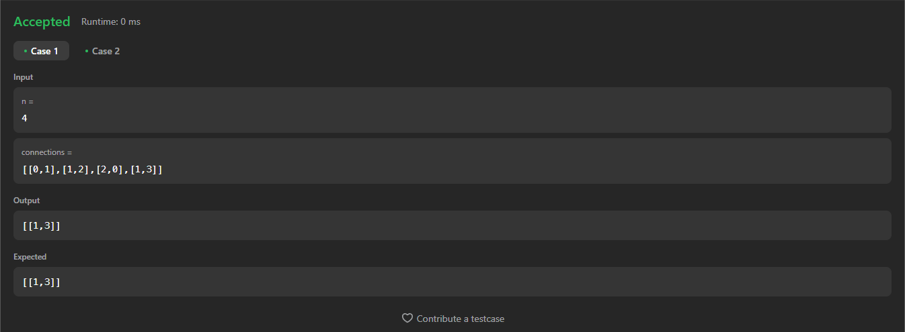
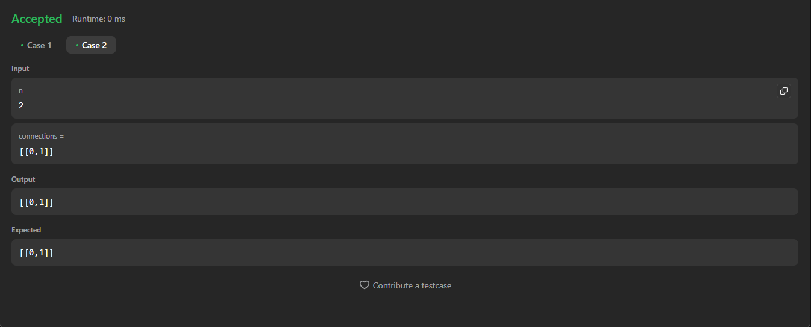
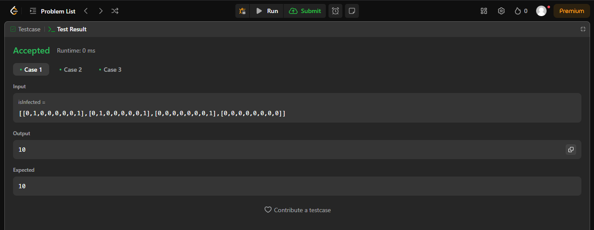
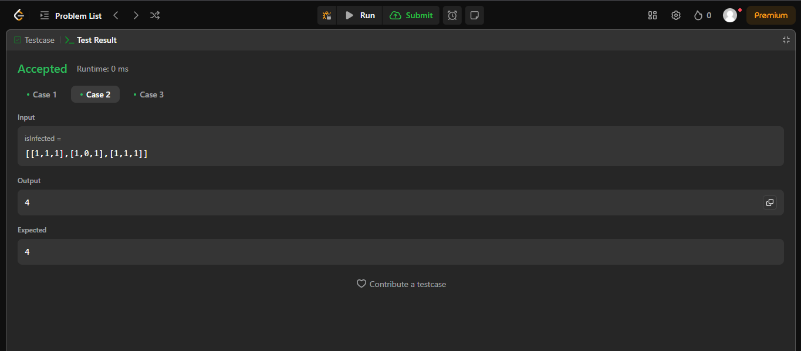
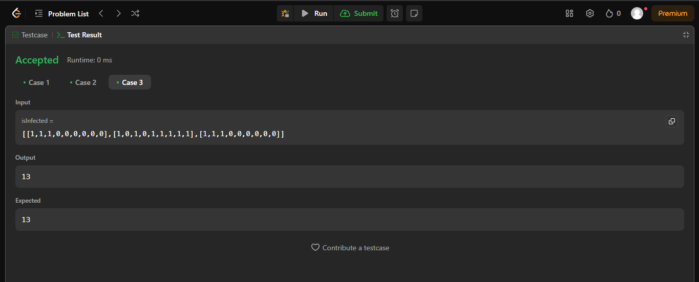

# Grafo1_Codeforces_Questions
**Número da Lista:** 1  
**Conteúdo da Disciplina:** Grafos

---

## Alunos

| Matrícula   | Aluno                                |
|-------------|----------------------------------------|
| 221007591   | Júlio Cesar Gomes de Souza Crispim     |
| 211062197   | Marco Marques de Castro                |

---

## Sobre

Este trabalho tem como objetivo analisar e resolver uma seleção de questões relacionadas a grafos disponíveis na plataforma LeetCode. As soluções serão desenvolvidas aplicando os conhecimentos e técnicas estudados durante as aulas.

---

## Screenshots

Adicione 3 ou mais screenshots do projeto em funcionamento.

1. 
   

2. 
   
   

3. ](https://leetcode.com/problems/couples-holding-hands/description/)
4. ](https://leetcode.com/problems/number-of-operations-to-make-network-connected/description/)

---

## Instalação

- **Linguagem:** Python  
- **Framework:** (caso exista)
- **Pré-requisitos:** Compilador de Python.

### Link da Apresentação

