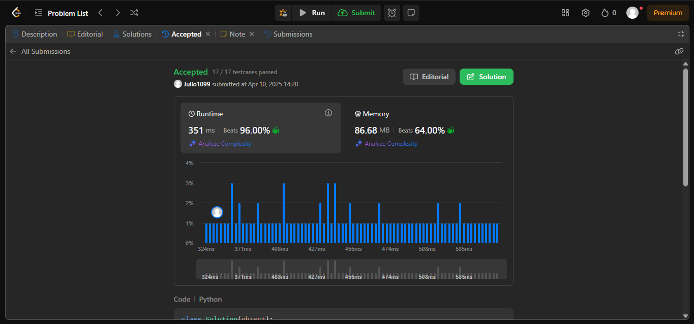
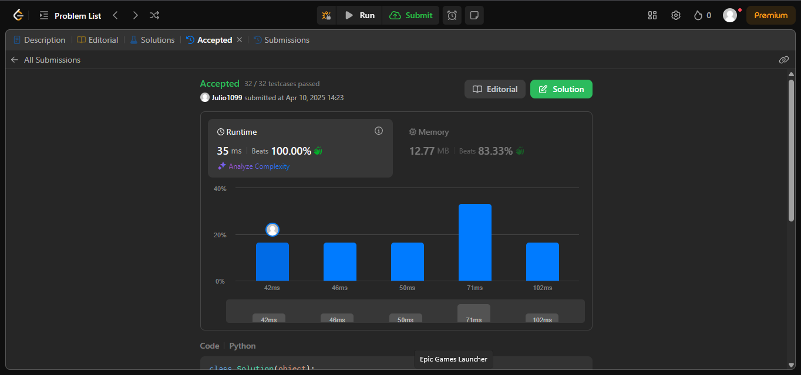
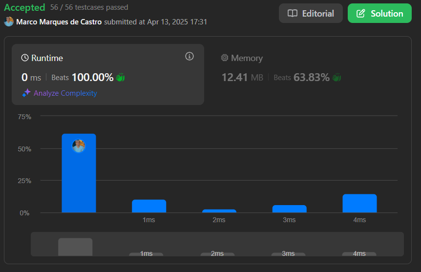
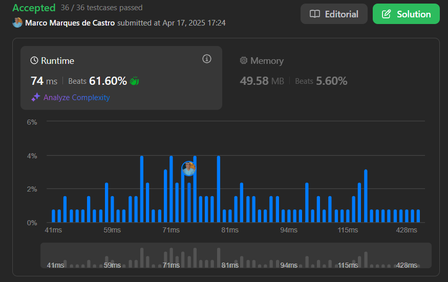

# Grafos1_LeetCode_Questions

**Número da Lista:** 1  
**Conteúdo da Disciplina:** Grafo1

---

## Alunos

| Matrícula | Aluno                     |
|-----------|---------------------------|
| 221007591 | Júlo Cesar Gomes          |
| 211062197 | Marco Marques de Castro   |

---

## Sobre

Este projeto tem como objetivo a resolução de exercícios da plataforma LeetCode, contemplando níveis de dificuldade médio e difícil. A iniciativa visa aplicar, na prática, os conceitos abordados em sala de aula.

---

## Screenshots

## [1192. Critical Connections in a Network](https://leetcode.com/problems/critical-connections-in-a-network/)

#### [Link do Código](code/1192._Critical_Connections_in_a_Network.py)

## [749. Contain Virus](https://leetcode.com/problems/contain-virus/description/)

#### [Link do Código](code/749._Contain_Virus.py)

## [765. Couples Holding Hands](https://leetcode.com/problems/couples-holding-hands/description/)

#### [Link do Código](code/765._Couples_Holding_Hands.py)

## [1319. Number of Operations to Make Network Connected](https://leetcode.com/problems/number-of-operations-to-make-network-connected/description/)

#### [Link do Código](code/1319.Number_of_Operations_to_Make_Network_Connected.py)

---

## Instalação

- **Linguagem:** python  
- **Framework:** (caso exista)

---

## Uso

Acesse a plataforma LeetCode, localize o exercício pelo número correspondente, insira o código na área de edição e clique em "Run" para executá-lo.

---

## Link da Apresentação

